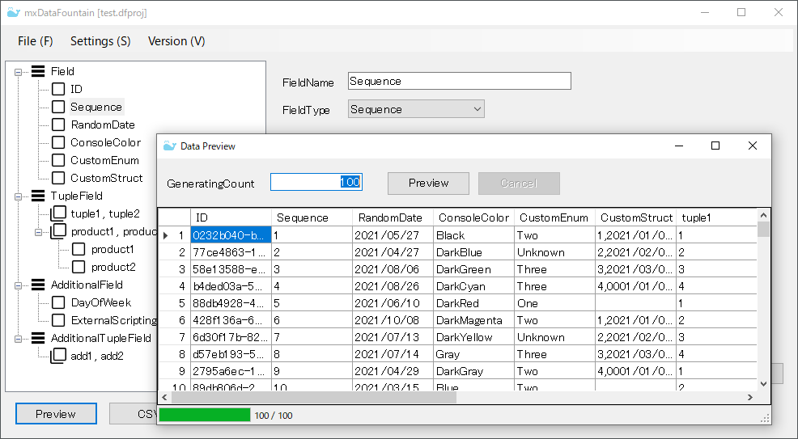

# DataGenerator

## mxProject.Devs.DataGenerator

The library for generating test data in data record format.

[English document](mxProject.Devs.DataGenerator/Readme.md)

[Japanese document](mxProject.Devs.DataGenerator/Readme.ja-jp.md)

## mxDataFountain

The data generation tool using `mxProject.Devs.DataGenerator`.

[English document](mxDataFountain/Readme.md)

[Japanese document](mxDataFountain/Readme.ja-jp.md)

