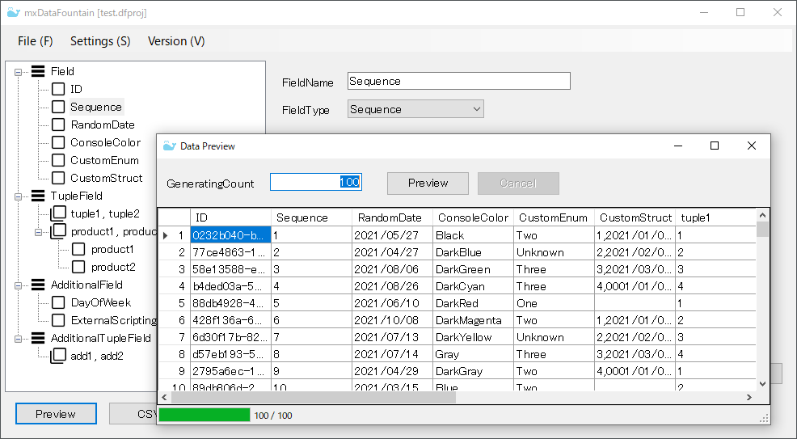
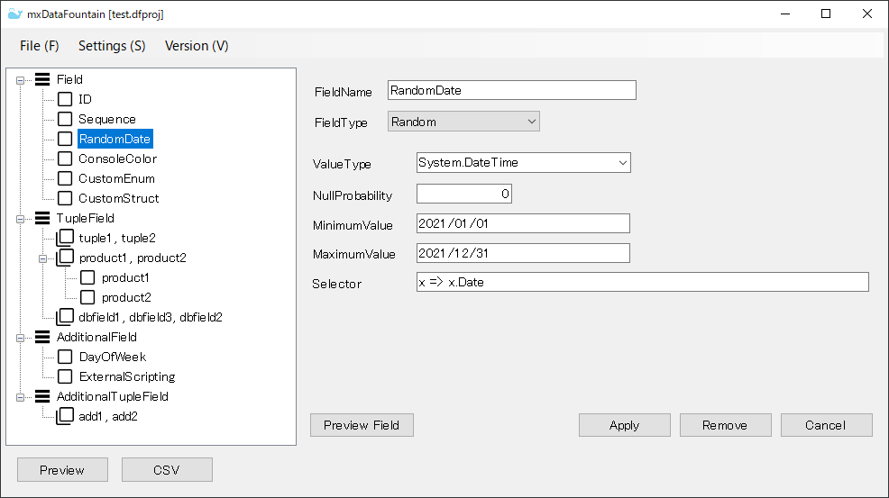
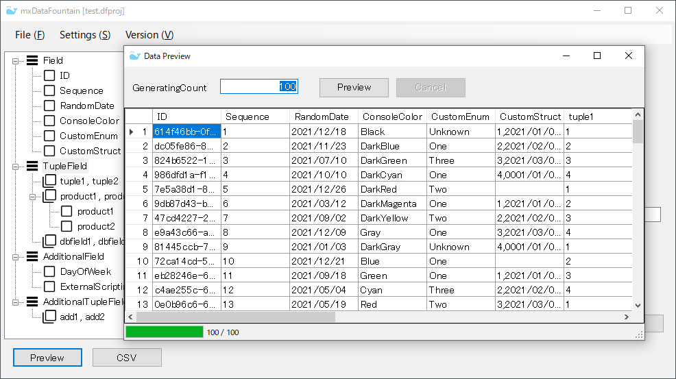

# mxDataFountain

[Japanese Document](Readne.ja-jp.md)

## Overview

* This application is a data generation tool using `mxProject.Devs.DataGenerator`.

* You can enter the data definition using GUI. The definitions you enter can be output in the form of a configuration file provided by `mxProject.Devs.DataGenerator`.

## Screenshot

## Usage

### Add a field

* Shows the context menu for Field, TupleField, AdditionalField, and AdditionalTupleField nodes. Enter the field definition in the editor displayed in the right pane and click [Apply] button to add the field.

* For DirectProduct field, add child fields from the context menu of the DirectProduct node.

  

### Edit the field

* The editor corresponding to the definition type of the selected field in the tree view appears in the right pane. Enter the field definition and click [Apply] button to update the field. 

* For Fields and TupleFields, you can use [Preview Field] button to preview the values generated from the field you are entering.

  

### Loading and saving configuration files

* You can use [File] menu to load and save the configuration file.

  |MenuItem|Description|
  |:--|:--|
  |New Project|Clear what you have entered in the form and start entering a new project.|
  |Load ProjectSettings|Load the mxDataFountain project file.|
  |Load DataGeneratorSettings|Load a JSON file that represents the contents of DataGeneratorSettings class provided by `mxProject.Devs.DataGenerator`.|
  |Save as ProjectSettings|Save what you enter in the form as an mxDataFountain project file.|
  |Save as DataGeneratorSettings|Save what you enter in the form as a JSON file that represents the content of DataGeneratorSettings class provided by `mxProject.Devs.DataGenerator`.|

  

### View the generated data

* Click [Preview] button. A preview dialog will be displayed and 100 data records will be generated. You can also enter and generate any number of data records.

  

### Output the generated data to a CSV file

* Click [CSV] button. Enter the output destination file path and the number of data records to be generated.

  

* To change the settings related to CSV output, show the setting dialog from  [Settings] > [Csv Settings] menu.

  

### Load any library

* If you want to generate a value of a value type defined in any library, add that library to the referenced assembly list. Show the settings dialog from the Settings> Executor Setup menu.

* You can also customize the context class used to generate the data in this settings dialog. Define a type that implements IDataGeneratorContextActivator interface provided by `mxProject.Devs.DataGenerator` and enter the type name here.

  

## Requirement

### Framework

* .NET Framework 4.7.2

### Main packages used

* mxProject.Devs.DataGenerator (>= 0.8.2)
  * Newtonsoft.Json (>= 12.0.3)
  * JsonSubTypes (>= 1.7.0)
  * Microsoft.CodeAnalysis.CSharp.Scripting (>= 3.7.0)
* CsvHelper (>= 27.1.1)
* MessagePipe (>= 1.6.1)
* Microsoft.Extensions.DependencyInjection (>= 5.0.2)

## Install

* If .NET Framework 4.7.2+ runtime is not installed in your environment, obtain it from the Microsoft website and install it.

* Please download the zip file from the release page of this repository and unzip it to any folder. The executable file for this application is mxDataFountain.exe. 

## License

* [MIT Licence](https://github.com/tcnksm/tool/blob/master/LICENCE)
