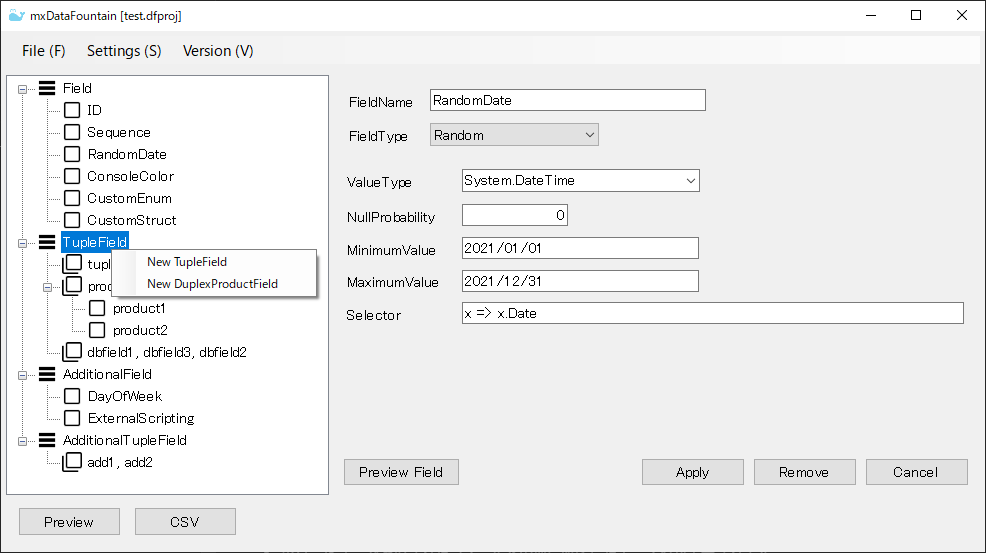
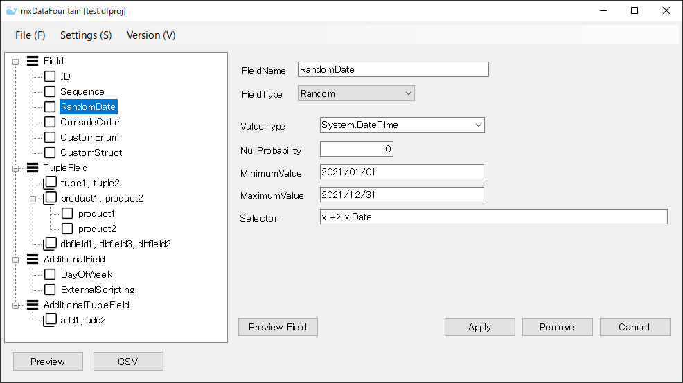
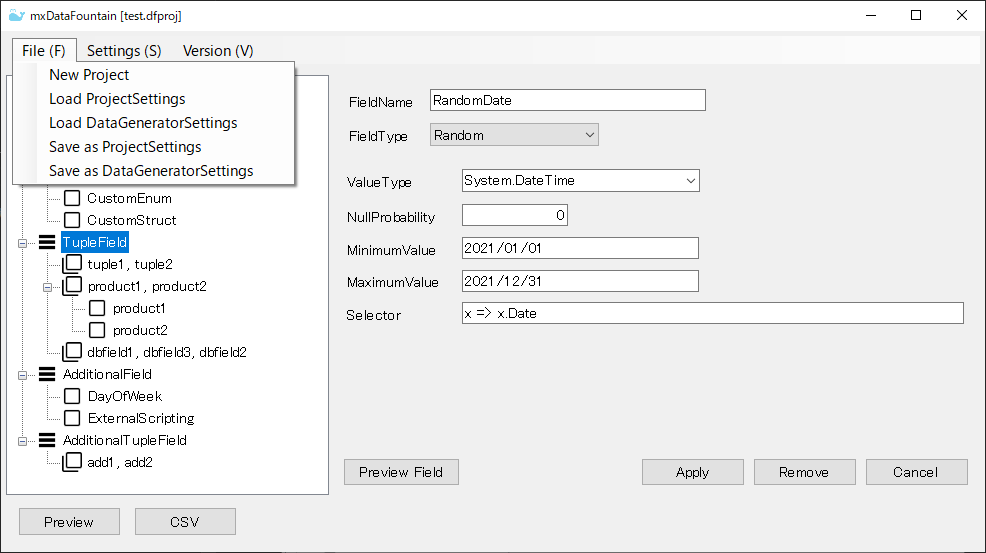
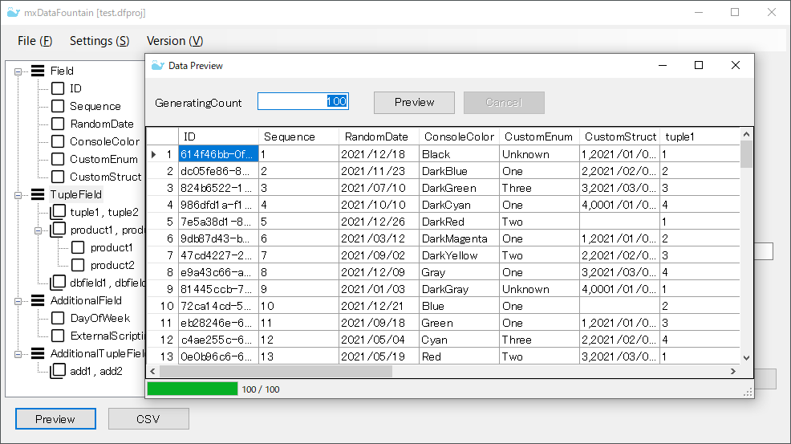
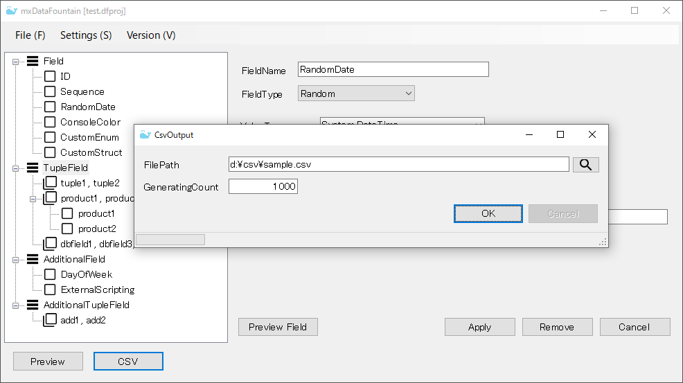
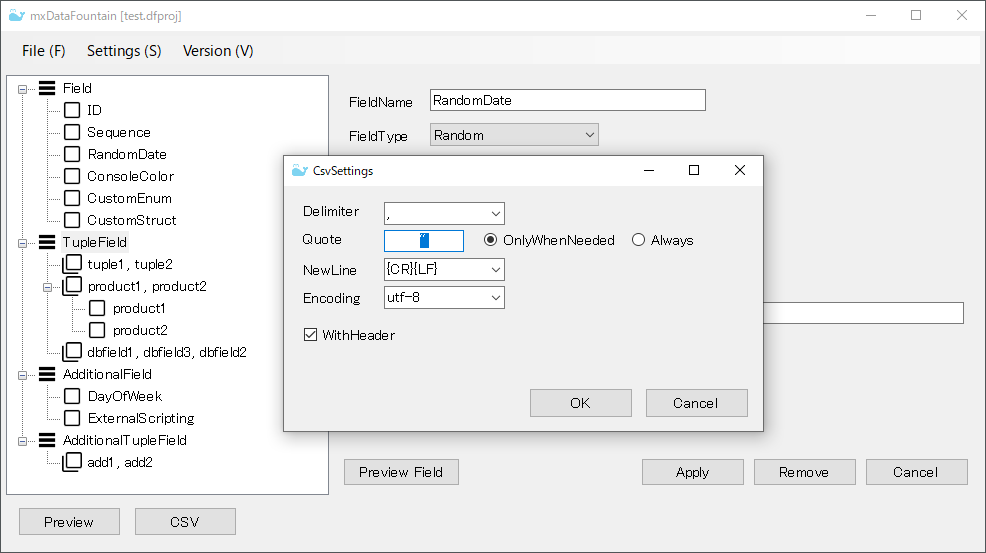
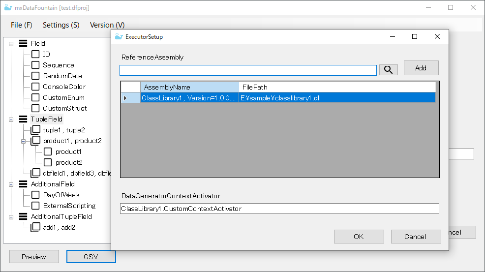

# mxDataFountain

[English Document](Readne.md)

## 概要

* このアプリケーションは `mxProject.Devs.DataGenerator` を使用したデータ生成ツールです。

* 生成するデータの定義をGUIで入力することができます。入力した定義を `mxProject.Devs.DataGenerator` が提供する構成ファイルの形式で出力することができます。

## スクリーンショット

## 使用方法

### フィールドの追加

* Field, TupleField, AdditionalField, AdditionalTupleField ノードのコンテキストメニューを表示してください。右側に表示されるエディタにフィールドの定義を入力して Apply ボタンを押すと、フィールドが追加されます。

* DirectProduct フィールドの場合、DirectProduct ノードのコンテキストメニューから子フィールドを追加してください。

  

### フィールドの編集

* ツリービューで選択されたフィールドの型に対応したエディタが表示されます。フィールドの定義を入力して Apply ボタンを押すと、フィールドが更新されます。

* Field, TupleField の場合、Preview Field ボタンで入力中のフィールドから生成される値をプレビューすることができます。

  

### 構成ファイルの読込と保存

* File メニューでは構成ファイルの読込と保存を行うことができます。

  |メニュー|説明|
  |:--|:--|
  |New Project|入力されている内容をクリアして新規プロジェクトの入力を開始します。|
  |Load ProjectSettings|mxDataFountain プロジェクトファイルを読み込みます。|
  |Load DataGeneratorSettings|`mxProject.Devs.DataGenerator` の DataGeneratorSettings に対応した JSON ファイルファイルを読み込みます。|
  |Save as ProjectSettings|入力されている内容を mxDataFountain プロジェクトファイルとして保存します。|
  |Save as DataGeneratorSettings|入力されている内容を `mxProject.Devs.DataGenerator` の DataGeneratorSettings に対応した JSON ファイルファイルとして保存します。|

  

### プレビュー

* Preview ボタンをクリックすると、プレビューダイアログが表示されます。100 件のデータが生成されます。任意のデータ件数を入力して生成することもできます。

  

### CSVファイル出力

* CSV ボタンをクリックすると、CSV出力ダイアログが表示されます。ファイルパスと生成するデータ件数を入力します。

  

* CSV出力に関する動作設定を変更するには、Settings > CsvSettings メニューから設定画面を表示してください。

  

### 任意のライブラリの読込

* 任意のライブラリに定義された値型の値を生成したい場合、そのライブラリを参照アセンブリリストに追加してください。Settings > ExecutorSetup メニューから設定画面を表示してください。

* この設定画面では、データ生成に使用されるコンテキストクラスをカスタマイズすることもできます。`mxProject.Devs.DataGenerator` の IDataGeneratorContextActivator インターフェースを実装した型を定義し、その型名をここに入力してください。

  

## 動作要件

### フレームワーク

* .NET Framework 4.7.2

### 利用している主なパッケージ

* mxProject.Devs.DataGenerator (>= 0.8.2)
  * Newtonsoft.Json (>= 12.0.3)
  * JsonSubTypes (>= 1.7.0)
  * Microsoft.CodeAnalysis.CSharp.Scripting (>= 3.7.0)
* CsvHelper (>= 27.1.1)
* MessagePipe (>= 1.6.1)
* Microsoft.Extensions.DependencyInjection (>= 5.0.2)

## インストール

* .NET Framework 4.7.2 ランタイムがインストールされていない場合は、マイクロソフトのWEBサイトなどから入手してインストールしてください。

* このリポジトリのリリースページから圧縮ファイルをダウンロードし、任意のフォルダに展開してください。アプリケーションの実行ファイルは mxDataFountain.exe です。

## ライセンス

* [MIT Licence](https://github.com/tcnksm/tool/blob/master/LICENCE)
